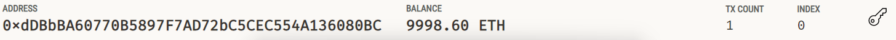
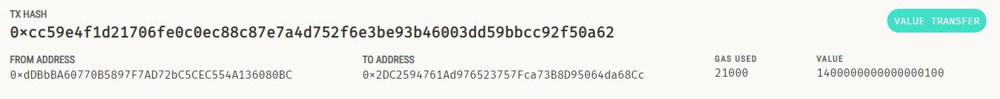

# Cryptocurrency Wallet

### **Objective**:
Implement Ethereum transactions for KryptoJobs2Go, a service for paying fintech pros in crypto.

### **Key Tasks**:

- **Generate Account**: Using your mnemonic seed phrase.
- **Fetch Balance**: Show your Ethereum balance.
- **Transaction Management**: Calculate, sign, and dispatch transactions.
- **Verify**: Confirm transactions on the Ganache blockchain.

### **Setup**:

1. Update `SAMPLE.env` with Ganache mnemonic and rename to `.env`.
2. Use `generate_account` to initialize an account in the Streamlit sidebar.
3. Show balance using `get_balance`.
4. Choose a candidate, set hours, compute the fee, and transmit the transaction.

---

### **Verification**:
Post-transaction, validate it on Ganache.

---

### **Wrap-Up**:
This task enabled Ethereum functions in a Streamlit app, facilitating crypto payments on KryptoJobs2Go. Always authenticate transactions on the blockchain.
